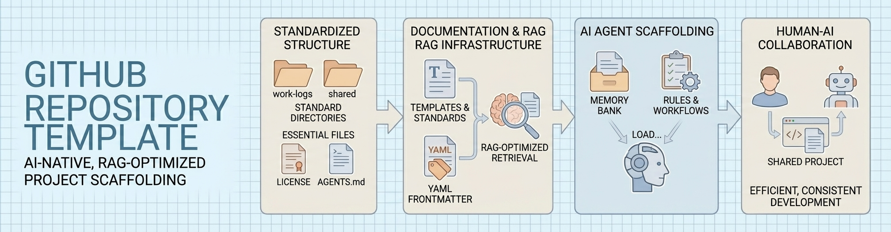

<!--
---
title: "Holdfast — Browser-Based Roguelite Deckbuilder"
description: "A finite-campaign roguelite deckbuilder where everything runs on a universal modifier engine"
author: "CrainBramp"
date: "2026-03-03"
version: "0.1.0"
status: "Pre-Implementation"
tags:
  - type: project-root
  - domain: [game-dev, card-game, roguelite]
  - tech: [react, python, json]
related_documents:
  - "[Game Design Document](docs/game-design-document.md)"
  - "[GDR Research Output](docs/research/)"
---
-->

# 🃏 Holdfast

[](https://react.dev)
[](https://python.org)
[](LICENSE)



> A finite-campaign roguelite deckbuilder where every mechanic runs on a single universal modifier engine, every card has a trade-off, and the procedural generation can absolutely kill you.

Holdfast is a browser-based card game where the player inherits an outpost on the edge of hostile territory and must conquer 6 procedurally generated regions to win. Combat, exploration, upgrades, and strategy all resolve through the same 5-stat modifier model. Some seeds are brutal. Some are unwinnable. The game's identity lives in that variance — interesting decisions under uncertainty, not guaranteed fairness.

---

## 🔭 Overview

### Design Lineage

The design draws from Soda Dungeon (idle dungeon loop, party roster), Darkest Dungeon (attrition pressure, environmental hazards), Across the Obelisk (card upgrade paths that add effects rather than scale numbers), Legend of Keepers (hazards as pure modifier encounters), Risk (strategic map control, incomplete information), and FTL (procedural maps, resource scarcity).

### Core Concept

Everything in the game — cards, characters, hazards, outpost upgrades, world events — is expressed as modifier arrays on a shared 5-stat model (HP, Power, Speed, Defense, Energy). One resolver engine handles all encounter types. Flavor text is cosmetic. The math is the game.

### Why a Card Game

The card game format was chosen because it is the most agent-friendly implementation path. Pure state machines and data — no physics, no real-time input, no animation dependencies. React handles state management and click targets. Python handles balance simulation. Shared JSON definitions tie them together.

---

## 📊 Project Status

| Phase | Status | Description |
|-------|--------|-------------|
| Game Design Document | ✅ Complete | Full mechanical spec — [GDD](docs/game-design-document.md) |
| Research Validation | ✅ Complete | Gemini Deep Research (NSB-bounded) |
| Phase 1: Simulation | ⬜ Next | Python Monte Carlo — card math, combo detection, balance |
| Phase 2: Minimal Playable | ⬜ Planned | React browser game — ugly but functional |
| Phase 3: Visual Polish | ⬜ Planned | 2D Pixel Quest asset integration, animations, sound |

---

## 🏗️ Architecture

Two applications sharing a data layer — a Python simulation and a React frontend, both consuming the same JSON card/region/character definitions.

### Components

| Component | Technology | Purpose | Status |
|-----------|------------|---------|--------|
| Game Frontend | React + Tailwind | Browser-playable card game | ⬜ Phase 2 |
| Balance Simulation | Python | Monte Carlo testing across 10K seeds | ⬜ Phase 1 |
| Shared Data | JSON | Card, character, region, encounter definitions | ⬜ Phase 1 |
| Game State | Redux-style reducer | Deterministic, serializable state machine | ⬜ Phase 2 |

### Key Design Decisions

The **ResolverEngine** operates independently of React — it calculates full turns synchronously and outputs ActionTuple arrays. React is a dumb renderer consuming tuples with CSS transitions. This prevents UI state desynchronization.

The **simulation targets 40-70% win rate** across seeds. It validates card math and decision quality, not seed solvability. Three AI heuristics (aggressive, defensive, balanced) play thousands of campaigns — if they converge on the same strategy, the game lacks meaningful choice.

---

## 📁 Repository Structure

```
holdfast-deckbuilder/
├── 📂 assets/                # Game art (2D Pixel Quest UI pack, card templates)
├── 📂 data/                  # Shared JSON definitions (cards, characters, regions)
├── 📂 docs/                  # Design documentation and research
│   ├── game-design-document.md
│   └── research/             # GDR output, reference material
├── 📂 game/                  # React frontend (Phase 2+)
├── 📂 simulation/            # Python Monte Carlo (Phase 1)
├── 📂 scratch/               # Temporary working files (gitignored)
├── 📂 staging/               # Pre-commit staging
├── 📄 AGENTS.md              # Agent context and session pattern
├── 📄 README.md              # This file
└── 📄 [config]               # .gitignore, cspell, markdownlint, .vscode
```

---

## 🎮 Game Summary

### Campaign Loop

Start with an outpost, one character, and a fog-covered map of 6 regions. Research reveals region details in layers. Assault regions by selecting a party (max 3-4 from roster) and progressing through 3 narrative encounters (Approach → Settlement → Stronghold). Conquer a region to earn meta-upgrades, card upgrades, and a new character draft. Between regions, face 3 rounds of world deck cards — every card has both an upside and a downside.

### The Universal Modifier Engine

Every effect resolves as a modifier tuple: stat, operation, value, duration, target. Resolution follows strict priority: base → flat → percentage → multiplicative. One engine, one resolution path, applied everywhere.

### Procedural Characters

No fixed classes. Characters are procedurally generated with randomized stat distributions across the 5-stat model and an innate passive modifier. High HP/Defense/low Speed naturally produces a tank. High Power/Speed/low HP produces a glass cannon. Party composition against region modifiers is the core strategic decision.

### The Unwinnable Seed

The procedural generator does not guarantee solvable campaigns. This is the game's identity. The simulation validates that the distribution is healthy, not that every seed is fair.

---

## 🚀 Getting Started

> **Note:** No runnable code yet — the project is in pre-implementation. The GDD is the current deliverable.

### Read the Design

The [Game Design Document](docs/game-design-document.md) is the source of truth for all mechanics, systems, and architecture decisions.

### Implementation Roadmap

Phase 1 (Simulation) begins with JSON schema definitions in `data/` and the Python resolver engine in `simulation/`. See those directory READMEs for planned structure.

---

## 📄 License

This project is licensed under the MIT License — see [LICENSE](LICENSE) for details.

---

## 🙏 Acknowledgments

- [2D Pixel Quest Vol.3 — The UI/GUI](https://barely-games.itch.io/2d-pixel-quest-the-uigui) — UI and card art assets
- [Gemini Deep Research](https://deepmind.google/technologies/gemini/) — Design validation via NSB-bounded research
- Design lineage: Soda Dungeon, Darkest Dungeon, Across the Obelisk, Legend of Keepers, FTL, Risk

---

Last Updated: 2026-03-03 | Status: Pre-Implementation
