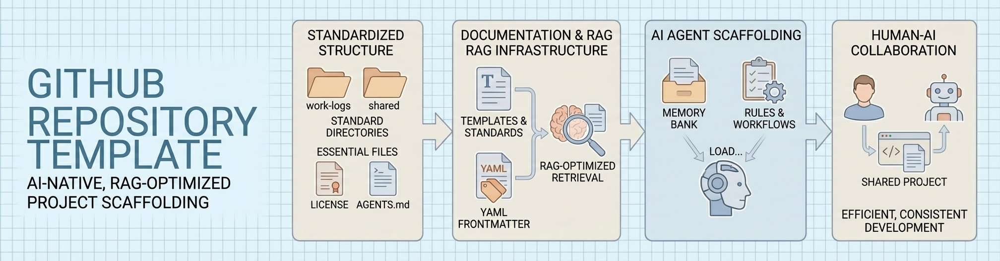
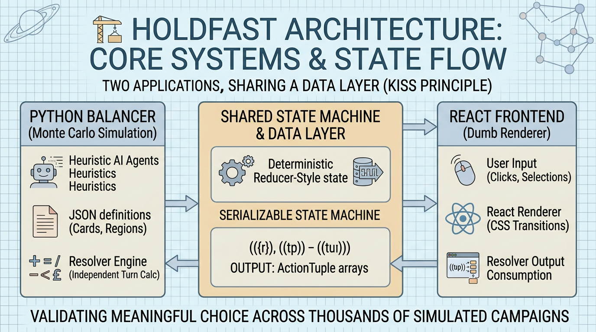

<!--
---
title: "Holdfast: Browser-Based Roguelite Deckbuilder"
description: "A finite-campaign roguelite deckbuilder where everything runs on a universal modifier engine"
author: "CrainBramp"
date: "2026-03-29"
version: "0.4.0"
status: "M4b First Playable — Card System Complete"
tags:
  - type: project-root
  - domain: [game-dev, card-game, roguelite]
  - tech: [typescript, python, json, gameui]
related_documents:
  - "[Game Design Document](docs/game-design-document.md)"
  - "[GDR Research Output](docs/research/)"
---
-->

# 🃏 Holdfast

[](https://www.typescriptlang.org/)
[](https://github.com/vintagedon/gameui-browser-gaming-framework)
[](https://python.org)
[](LICENSE)



> A finite-campaign roguelite deckbuilder where every mechanic runs on a single universal modifier engine, every card has a trade-off, and the procedural generation can absolutely kill you.

Holdfast is a browser-based card game where the player inherits an outpost on the edge of hostile territory and must conquer 6 procedurally generated regions to win. Combat, exploration, upgrades, and strategy all resolve through the same 5-stat modifier model. Some seeds are brutal. Some are unwinnable. The game's identity lives in that variance: interesting decisions under uncertainty, not guaranteed fairness.

This project is also an experiment in **AI-assisted, spec-driven game development**, building a complete game end-to-end using [OpenSpec](https://github.com/Fission-AI/OpenSpec) for specification management, AI coding agents (Claude, OpenCode) for implementation, and Monte Carlo simulation for balance validation. The GDD was co-authored with Claude, validated through Gemini Deep Research, and every implementation milestone is spec'd as OpenSpec change proposals that agents execute from. If it works, the methodology is as interesting as the game.

---

## 🔭 Overview

### Design Lineage

The design draws from Soda Dungeon (idle dungeon loop, party roster), Darkest Dungeon (attrition pressure, environmental hazards), Across the Obelisk (card upgrade paths that add effects rather than scale numbers), Legend of Keepers (hazards as pure modifier encounters), Risk (strategic map control, incomplete information), and FTL (procedural maps, resource scarcity).

### Core Concept

Everything in the game (cards, characters, hazards, outpost upgrades, world events) is expressed as modifier arrays on a shared 5-stat model (HP, Power, Speed, Defense, Energy). One resolver engine handles all encounter types. Flavor text is cosmetic. The math is the game.

Character names, attack names, and region names are assembled at generation time from seeded word pools, weighted by the entity's dominant stats. "Mira the Swift, Storm Mage" and "Dusk the Volatile, Void Warden" are the same underlying modifier bundle in different clothes. This creates campaign variety without additional content. The flavor data lives in `mods/default/`; the architecture is mod-ready from day one.

### Why a Card Game

The card game format was chosen because it is the most agent-friendly implementation path. Pure state machines and data, no physics, no real-time input, no animation dependencies. A vanilla DOM screen router handles state and click targets over the GameUI framework. Python handles balance simulation. Shared JSON definitions tie them together.

### Development Methodology

Each milestone is specified as an [OpenSpec](https://github.com/Fission-AI/OpenSpec) change proposal with detailed specs, design docs, and task checklists. AI coding agents execute against these specs, with human review before every commit. The workflow: Claude orchestrates design and spec authoring, OpenSpec captures the contract, agents implement against the spec, human reviews and commits. This is a deliberate test of whether spec-driven AI development can produce a complete, balanced game.

---

## 📊 Project Status

| Milestone | Status | Description |
|-----------|--------|-------------|
| Game Design Document | ✅ Complete | Full mechanical spec: [GDD](docs/game-design-document.md) |
| Research Validation | ✅ Complete | Gemini Deep Research (NSB-bounded) |
| Repo & Tooling Setup | ✅ Complete | Repository, OpenSpec, GitHub milestones/issues |
| M1: Data Schemas | ✅ Complete | Pydantic models, JSON data files, 95 tests |
| M2a: Resolver Engine & Combat | ✅ Complete | Stat resolver, CT turn order, encounter resolution, enemy AI |
| M2b: Procedural Generation | ✅ Complete | Character/enemy/region/encounter generators from seeded RNG |
| M2c: Campaign Loop | ✅ Complete | Data loader, campaign state machine, full macro loop |
| M2d: AI Heuristics & Monte Carlo | ✅ Complete | 3 player AIs, enhanced enemy AI, Monte Carlo runner |
| M3a: Balance Analysis | ✅ Complete | 5000-seed telemetry, 15 plots, balance report |
| M3b: Deck Mechanics | ✅ Complete | Hand/draw/discard system, upgrade tree loader, deep_focus_01 fix |
| M3c: Balance Tuning | ✅ Complete | Speed cap, AI fixes, enemy HP tuning |
| M3d: Final Balance | ✅ Complete | Stun fix, AggressiveAI v2, upgrade randomization |
| M4a: TS Resolver Port | ✅ Complete | Browser-safe TypeScript simulation package + parity tests |
| M4b-GUI: GameUI Frontend Shell | ✅ Complete | Full-DOM GameUI dark-fantasy shell, vanilla screen router, placeholder screens, Playwright baselines |
| M4b-GUI-06: Card System Rewrite | ✅ Complete | Frozen adapter contract, tall five-layer mixed SVG/PNG art, Runic card backs, full 21-card contact sheet, build/publish hardening |
| M4b-GUI-04: Combat Screen | ⬜ Next | Compose the finished card system into the stepper-driven combat surface after operator approval |
| M4b-GUI-05: Flow Screens | ⬜ Queued | Complete the remaining campaign-flow screens after combat |
| M6: Visual Polish | ⬜ Planned | Asset integration, animations, effects |

**367 simulation tests and 101 frontend tests passing**, plus 8 Playwright dark-fantasy baselines and the production build-output gate. Run `pytest simulation/tests/ -v` from repo root and `npm test` from `game/`.

### M3d Balance Results (5000 seeds x 3 strategies)

| Strategy | Win Rate | Avg Regions | Avg Turns |
|----------|----------|-------------|-----------|
| aggressive | 49.9% | 4.29 | 67 |
| defensive | 42.2% | 4.17 | 52 |
| balanced | 51.3% | 4.40 | 61 |
| **Spread** | **9.1%** | | |

All strategies in the 40-55% target band. No degenerate signals detected.

---

## 🏗️ Architecture

Two applications sharing a data layer: a Python simulation and a full-DOM GameUI frontend, both consuming the same JSON card/region/character definitions.



### Key Design Decisions

The ResolverEngine operates independently of the UI; it calculates full turns synchronously and outputs ActionTuple arrays. The DOM screen router is a dumb renderer consuming stepper state through its public surface. This prevents UI state desynchronization.

The simulation targets 40-70% win rate across seeds. It validates card math and decision quality, not seed solvability. Three AI heuristics (aggressive, defensive, balanced) play thousands of campaigns; if they converge on the same strategy, the game lacks meaningful choice.

---

## 📁 Repository Structure

```
holdfast-roguelite-deckbuilder/
├── 📂 assets/                  # Game art (licensed asset pack, gitignored)
├── 📂 data/                    # Shared JSON definitions (cards, characters, regions, world deck)
├── 📂 docs/                    # Design documentation and research
│   ├── 📄 game-design-document.md
│   ├── 📂 documentation-standards/
│   └── 📂 research/            # GDR output, reference material
├── 📂 game/                    # Full-DOM GameUI frontend (dark-fantasy)
├── 📂 internal-files/          # Working documents
├── 📂 mods/                    # Mod-ready content layer
│   └── 📂 default/flavor/     # Word pools, epithet conditions, element-stat maps
├── 📂 openspec/                # OpenSpec metadata and archived change proposals
├── 📂 reports/                 # Monte Carlo analysis outputs
├── 📂 scripts/                 # Helper scripts
├── 📂 shared/                  # Cross-project utilities
├── 📂 simulation/              # Python Monte Carlo simulation (Phase 1)
│   ├── 📂 models/             # Pydantic data models (M1)
│   ├── 📂 engine/             # Resolver engine (M2a)
│   ├── 📂 generation/         # Procedural generators (M2b)
│   ├── 📂 campaign/           # Campaign loop (M2c)
│   ├── 📂 agents/             # AI heuristics and Monte Carlo runner (M2d)
│   └── 📂 tests/              # 367 tests
├── 📂 staging/                 # Staged work
├── 📄 AGENTS.md                # Agent context and session pattern
├── 📄 CLAUDE.md                # Pointer to AGENTS.md
├── 📄 README.md                # This file
└── 📄 pyproject.toml
```

Active implementation specs live in the shared queue at `/opt/agents/repos/spec/`, outside this repository.

---

## 🎮 Game Summary

### Campaign Loop

Start with an outpost, one character, and a fog-covered map of 6 regions. Research reveals region details in layers. Assault regions by selecting a party (max 3-4 from roster) and progressing through 3 narrative encounters (Approach, Settlement, Stronghold). Conquer a region to earn meta-upgrades, card upgrades, and a new character draft. Between regions, face 3 rounds of world deck cards; every card has both an upside and a downside.

### The Universal Modifier Engine

Every effect resolves as a modifier tuple: stat, operation, value, duration, target. Resolution follows strict priority: base, flat, percentage, multiplicative. One engine, one resolution path, applied everywhere.

### Procedural Characters

No fixed classes. Characters are procedurally generated with randomized stat distributions across the 5-stat model and an innate passive modifier. High HP/Defense/low Speed naturally produces a tank. High Power/Speed/low HP produces a glass cannon. Party composition against region modifiers is the core strategic decision.

### The Unwinnable Seed

The procedural generator does not guarantee solvable campaigns. This is the game's identity. The simulation validates that the distribution is healthy, not that every seed is fair.

---

## 🚀 Getting Started

### Prerequisites

- Python 3.12+
- `pip install -r simulation/requirements.txt` (pydantic, pytest)

### Run the Tests

```bash
pytest simulation/tests/ -v
```

### Run a Campaign

```python
from campaign.loader import load_game_data
from campaign.runner import run_campaign
from agents.heuristics import BalancedAI

game_data = load_game_data()
result = run_campaign(seed=42, game_data=game_data, strategy=BalancedAI())
print(f"Victory: {result.victory}, Regions cleared: {result.regions_cleared}")
```

### Run Monte Carlo

```python
from campaign.loader import load_game_data
from agents.monte_carlo import run_monte_carlo, MonteCarloConfig, monte_carlo_to_json
from pathlib import Path

game_data = load_game_data()
config = MonteCarloConfig(seed_start=1, seed_count=100)
result = run_monte_carlo(config, game_data)
monte_carlo_to_json(result, Path("monte_carlo_results.json"))
```

### Read the Design

The [Game Design Document](docs/game-design-document.md) is the source of truth for all mechanics, systems, and architecture decisions.

---

## 📄 License

This project is licensed under the MIT License. See [LICENSE](LICENSE) for details.

---

## 🙏 Acknowledgments

- [2D Pixel Quest Vol.3, The UI/GUI](https://barely-games.itch.io/2d-pixel-quest-the-uigui) for UI and card art assets
- [Gemini Deep Research](https://deepmind.google/technologies/gemini/) for design validation via NSB-bounded research
- Design lineage: Soda Dungeon, Darkest Dungeon, Across the Obelisk, Legend of Keepers, FTL, Risk

---

Last Updated: 2026-03-29 | Status: M3d Complete, 377 Tests Passing
